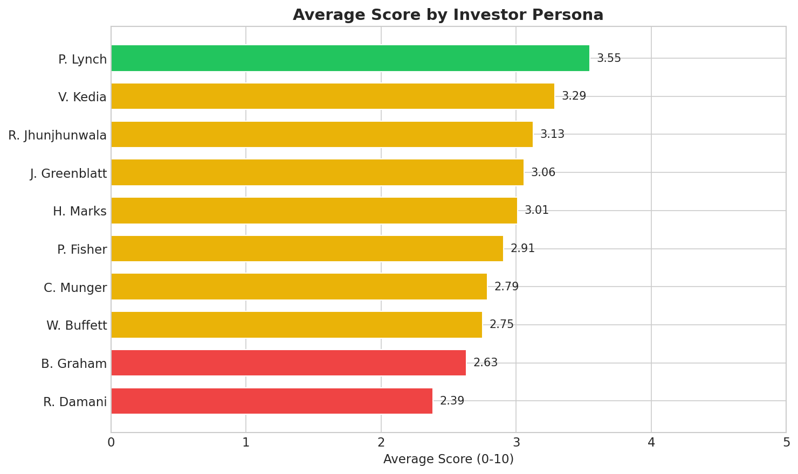
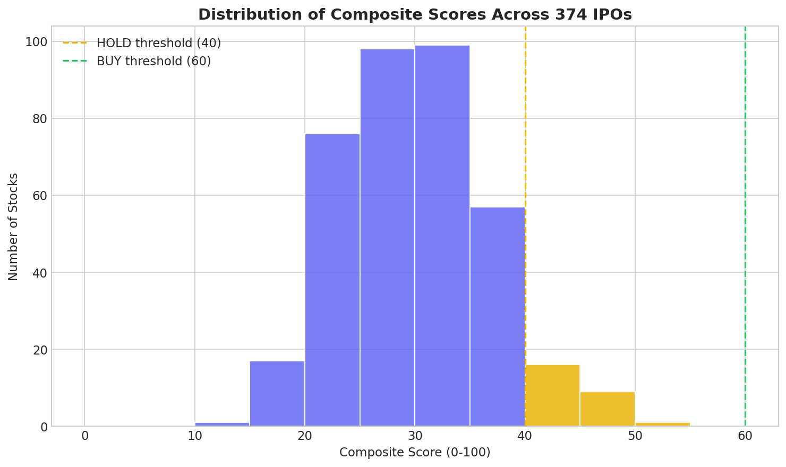
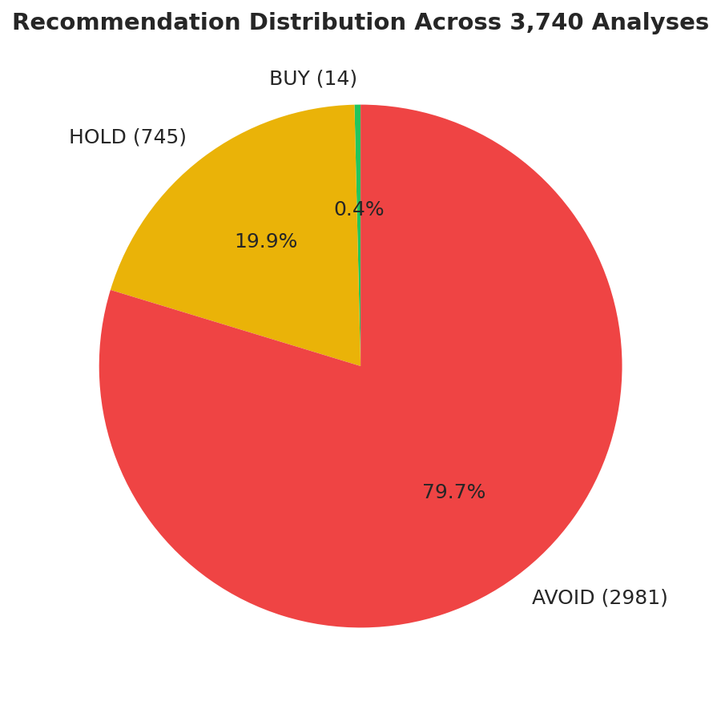
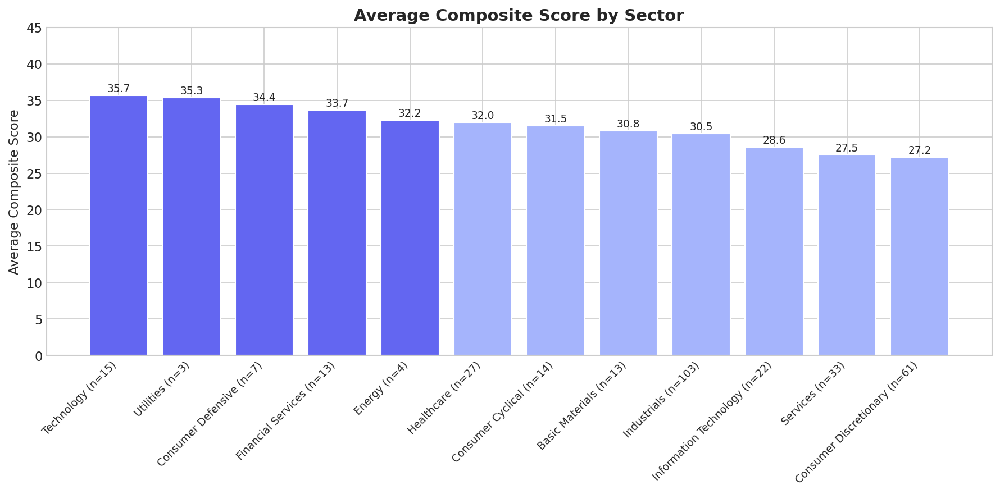
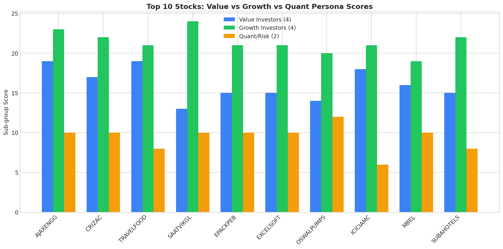
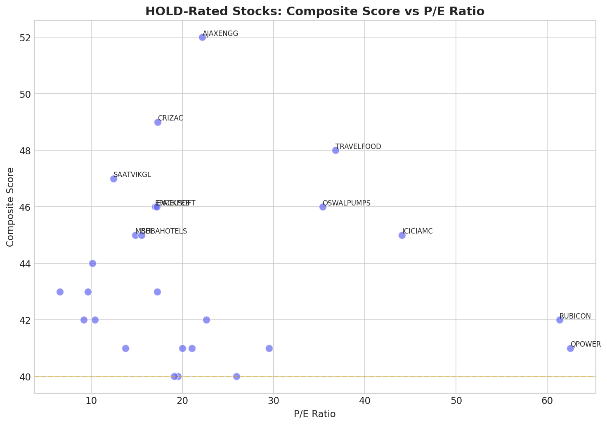
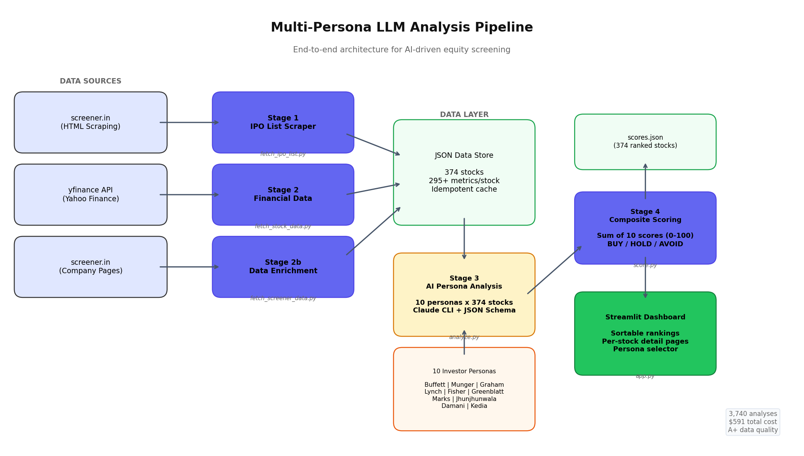

# Multi-Persona LLM Analysis for Equity Screening: Evidence from 374 Indian IPOs

**Working Paper -- March 2026**

---

## Abstract

We present a system for automated equity screening that applies 10 distinct investor-persona prompts to a large language model, generating structured investment analyses for 374 recent Indian IPO stocks. Each stock is evaluated through the documented frameworks of legendary investors -- from Benjamin Graham's deep value criteria to Vijay Kedia's small-cap SMILE framework -- producing 3,740 individual analyses with structured scores, recommendations, and qualitative reasoning. We describe the full technical pipeline: multi-source financial data ingestion (screener.in HTML scraping, yfinance API), persona-specific prompt engineering with JSON schema enforcement, idempotent execution with atomic writes, and a self-healing batch runner. The system achieved an A+ data quality grade with all 3,740 output files valid and parseable. Composite scoring reveals extreme consensus skepticism toward IPOs (93.0% AVOID), meaningful inter-persona variation (standard deviations 0.75--1.10), and sector-differentiated signals. Total inference cost was approximately $591 on Claude Sonnet. We discuss the system's utility as an AI-augmented screening layer and its limitations as a standalone investment tool.

---

## 1. Introduction

### 1.1 Problem

India's IPO market has undergone rapid expansion, with over 370 companies listing on the NSE and BSE in 2025 alone -- spanning mainboard large-caps and SME micro-caps. Retail investors face an information asymmetry problem: institutional research coverage is thin for small and mid-cap IPOs, multi-year financial track records are unavailable by definition, and listing-day hype cycles make dispassionate analysis difficult.

### 1.2 Gap

Existing AI-for-finance research has largely focused on sentiment analysis of news or social media, technical indicator prediction, or single-framework valuation models. The question of whether LLMs can replicate the *qualitative reasoning patterns* of distinct investment philosophies -- and whether multi-persona consensus yields better signal than any single perspective -- remains underexplored, particularly in emerging market contexts where data coverage is uneven.

### 1.3 Contribution

This paper makes three contributions. First, we demonstrate a production-grade pipeline that transforms raw financial data into structured, multi-perspective investment analyses at scale. Second, we provide empirical evidence on inter-persona agreement and disagreement across 374 stocks and 13 sectors, using real data from the Indian IPO market. Third, we document the engineering decisions -- token optimization, cost management, fault tolerance -- required to make LLM-driven financial analysis economically viable.

---

## 2. Methodology

### 2.1 Persona Design

We constructed 10 investor personas spanning three axes of variation:

**By geography:** 7 international (Buffett, Munger, Graham, Lynch, Fisher, Greenblatt, Marks) and 3 Indian-market specialists (Jhunjhunwala, Damani, Kedia).

**By philosophy:** Deep value (Graham, Damani), quality compounding (Buffett, Munger), growth-at-reasonable-price (Lynch, Fisher), quantitative factor-based (Greenblatt), risk-first contrarian (Marks), India growth conviction (Jhunjhunwala), and small-cap transformation (Kedia).

**By temperament:** Inherently skeptical of IPOs (Graham, Marks, Damani) versus open to growth stories (Lynch, Fisher, Kedia).

Each persona is implemented as a system prompt encoding the investor's philosophy, key metrics, red flags, and a calibrated scoring rubric (0--10 integer scale). Scoring guidance explicitly anchors expectations: "most IPOs should score 3--5," "7+ is rare," and "9--10 is once-in-a-decade." This calibration is critical to avoid score inflation, a known failure mode in LLM evaluation tasks.

### 2.2 Structured Output Enforcement

All analyses are constrained via Claude's `--json-schema` flag, which guarantees conformance to a fixed schema: integer score (0--10), enum recommendation (BUY/HOLD/AVOID), investment thesis (string), key strengths (array), key risks (array), red flags (array), detailed analysis (string), and a nested metrics object with five enum-valued qualitative assessments (moat strength, management quality, financial health, valuation, growth potential). This eliminates parsing ambiguity and makes outputs directly machine-consumable.

### 2.3 Composite Scoring

Individual persona scores (each 0--10) are summed to produce a composite score on a 0--100 scale. The consensus recommendation is determined by majority vote across the 10 personas, with three tiers: BUY (composite 60+), HOLD (40--59), AVOID (<40).

### 2.4 Token Optimization

A significant engineering contribution is the discovery that passing `--tools ""` (an empty tools parameter) to the Claude CLI reduces token consumption by approximately 47%, eliminating the built-in tool definitions from the context window. Per-call token usage dropped to approximately 16K input and 4.5K output tokens, yielding a cost of roughly $0.16 per analysis call.

---

## 3. Data

### 3.1 Sources

Financial data is ingested from two complementary sources:

| Source | Method | Coverage |
|--------|--------|----------|
| screener.in | HTML scraping with rate limiting | P&L, balance sheet, cash flow, key ratios, shareholding, company description |
| yfinance | Python API | 132 info fields, 51 income statement metrics x 3 years, 68 balance sheet metrics x 3 years, 44 cash flow metrics x 3 years, price history |

The dual-source approach is necessary because yfinance frequently has gaps for recent IPOs and BSE-only SME listings. Screener.in data fills these gaps, particularly for P/E, ROE, ROCE, book value, and market cap. Data quality scores are recalculated after each enrichment pass.

### 3.2 Coverage

- **374 stocks** analyzed across 13 sectors
- **3,740 total analyses** (374 stocks x 10 personas)
- Data quality audit grade: **A+**
- All 3,740 output files present, parseable, and schema-valid
- Only **1 minor persona inconsistency** identified (stock KEN: Graham scored higher than Lynch, reversing expected relative ordering)

### 3.3 Per-Stock Data Density

Each stock's input data package includes up to 132 info fields from yfinance, three years of income statement data (51 metrics per year), three years of balance sheet data (68 metrics per year), three years of cash flow data (44 metrics per year), plus screener.in P&L, balance sheet, cash flow, ratios, and shareholding tables. This dense context is summarized into a structured financial prompt covering valuation, profitability, growth, balance sheet, shareholding, and income statement highlights.

---

## 4. Results

### 4.1 Persona-Level Statistics

The 10 personas exhibited meaningful variation in scoring behavior, consistent with their encoded philosophies:

| Persona | Mean | Median | StDev | Min | Max | BUY | HOLD | AVOID |
|---------|------|--------|-------|-----|-----|-----|------|-------|
| Peter Lynch | 3.55 | 3.0 | 1.06 | 1 | 7 | 8 | 156 | 210 |
| Vijay Kedia | 3.29 | 3.0 | 1.05 | 1 | 6 | 0 | 137 | 237 |
| Rakesh Jhunjhunwala | 3.13 | 3.0 | 1.10 | 1 | 7 | 2 | 99 | 273 |
| Joel Greenblatt | 3.06 | 3.0 | 0.90 | 1 | 7 | 1 | 77 | 296 |
| Howard Marks | 3.01 | 3.0 | 0.75 | 1 | 5 | 0 | 78 | 296 |
| Philip Fisher | 2.91 | 3.0 | 1.07 | 1 | 7 | 3 | 65 | 306 |
| Charlie Munger | 2.79 | 3.0 | 0.86 | 1 | 7 | 0 | 39 | 335 |
| Warren Buffett | 2.75 | 3.0 | 0.75 | 1 | 6 | 0 | 23 | 351 |
| Benjamin Graham | 2.63 | 2.5 | 0.91 | 1 | 5 | 0 | 59 | 315 |
| Radhakishan Damani | 2.39 | 2.0 | 0.81 | 1 | 5 | 0 | 12 | 362 |

*Figure 1: Average score by investor persona, sorted ascending. Color indicates relative strictness: green (most generous), yellow (moderate), red (strictest).*

Several patterns merit discussion. The persona ordering by mean score aligns with theoretical expectations: Peter Lynch (GARP philosophy, most open to growth stories) is the most generous scorer at 3.55, while Radhakishan Damani (fortress balance sheets, ultra-conservative debt thresholds) is the strictest at 2.39. The spread of 1.16 points between most and least generous personas is meaningful on a 0--10 scale.

Standard deviations range from 0.75 (Buffett, Marks) to 1.10 (Jhunjhunwala), suggesting that conservative personas produce tighter score distributions while growth-oriented and conviction-based personas exhibit greater variance -- they are willing to score both higher and lower depending on the stock's fit with their framework.

### 4.2 Composite Score Distribution

| Statistic | Value |
|-----------|-------|
| Mean | 29.5 |
| Median | 29.0 |
| Stdev | 6.7 |
| Min | 11 |
| Max | 52 |

*Figure 2: Distribution of composite scores across 374 IPOs. Dashed lines indicate HOLD (40) and BUY (60) thresholds.*

*Figure 3: Aggregate recommendation distribution across 3,740 individual persona analyses.*

The composite distribution is strongly left-skewed relative to the theoretical midpoint of 50, reflecting the system's collective skepticism toward IPOs. The consensus breakdown is stark:

| Category | Threshold | Count | Percentage |
|----------|-----------|-------|------------|
| BUY | 60+ | 0 | 0.0% |
| HOLD | 40--59 | 26 | 7.0% |
| AVOID | <40 | 348 | 93.0% |

Zero stocks achieved a composite BUY rating. This is a feature, not a bug: the scoring calibration explicitly treats 7+ as rare and 9--10 as once-in-a-decade, and the IPO context (limited track records, potential overpricing by investment banks) activates skepticism across most personas.

### 4.3 Sector Analysis

*Figure 4: Average composite score by sector (minimum 3 stocks per sector). Sample size shown in parentheses.*

Average composite scores vary meaningfully by sector, ranging from 19.8 (Real Estate) to 35.7 (Technology):

| Sector | Count | Avg Score |
|--------|-------|-----------|
| Technology | 15 | 35.7 |
| Utilities | 3 | 35.3 |
| Consumer Defensive | 7 | 34.4 |
| Financial Services | 13 | 33.7 |
| Healthcare | 27 | 32.0 |
| Consumer Cyclical | 14 | 31.5 |
| Industrials | 103 | 30.5 |
| Information Technology | 22 | 28.6 |
| Services | 33 | 27.5 |
| Consumer Discretionary | 61 | 27.2 |
| FMCG | 27 | 26.7 |
| Commodities | 26 | 26.5 |
| Real Estate | 5 | 19.8 |

The Technology and Utilities sectors score highest, likely reflecting stronger moat characteristics and more predictable cash flows. Real Estate scores lowest, consistent with its capital-intensive, leveraged, and cyclical nature -- attributes that trigger red flags across nearly all personas. The large Industrials cohort (n=103) clusters near the overall mean, suggesting adequate sample size for this sector's score to be representative.

### 4.4 BUY Recommendation Convergence

Across all 3,740 analyses, only 14 individual BUY recommendations were issued:

| Persona | BUY Count |
|---------|-----------|
| Peter Lynch | 8 |
| Philip Fisher | 3 |
| Rakesh Jhunjhunwala | 2 |
| Joel Greenblatt | 1 |
| All others | 0 |

The concentration of BUYs among growth-oriented personas (Lynch, Fisher) and the India-growth-conviction persona (Jhunjhunwala) is consistent with their philosophies. Value-oriented personas (Buffett, Graham, Damani) and the risk-first persona (Marks) issued zero BUY recommendations -- they require either deep discounts to intrinsic value or multi-year earnings track records that IPOs cannot provide by definition.

### 4.5 Top-Ranked Stocks

The five highest-scoring stocks represent distinct investment theses:

| Rank | Stock | Score | Sector | Thesis |
|------|-------|-------|--------|--------|
| 1 | Ajax Engineering | 52 | Industrials | Self-loading concrete mixer monopoly in India |
| 2 | Crizac | 49 | Services | Study-abroad platform with secular demand |
| 3 | Travel Food | 48 | Consumer | Airport F&B monopoly positioning |
| 4 | Saatvik Green | 47 | Industrials | Solar PLI beneficiary, P/E 12.4x vs. peer at ~65x |
| 5 | EPack Prefab | 46 | Industrials | Prefabricated construction, capacity-led growth |

Notably, even the top-ranked stock (Ajax Engineering at 52/100) falls in the HOLD range, underscoring the system's conservative calibration.

---

## 5. Case Studies

### 5.1 Saatvik Green Energy: Valuation Gap as Signal

Saatvik Green Energy emerged as the system's most compelling value case study, scoring 47 with particular strength from quantitative and value-oriented personas. The core thesis rests on a stark valuation disparity with its closest comparable:

| Metric | Saatvik Green | Waaree Energies |
|--------|---------------|-----------------|
| Market Cap | 4,876 Cr | 91,400 Cr |
| Current Capacity | 4.8 GW | 15 GW |
| Planned Capacity | 8.8 GW (Odisha expansion) | -- |
| Valuation per GW (post-expansion) | 557 Cr/GW | 3,656 Cr/GW |
| P/E Ratio | 12.4x | ~65x |
| **Valuation Gap** | **6.6x cheaper per GW** | -- |

At 12.4x trailing earnings versus Waaree's approximately 65x, Saatvik trades at a fraction of the sector leader's valuation per unit of installed capacity. The 6.6x gap on a per-GW basis represents the kind of quantifiable margin of safety that activates value-oriented personas. Both Greenblatt's magic formula (high earnings yield, reasonable ROIC) and Lynch's GARP framework (low PEG given growth from the Odisha plant expansion) flagged this stock.

The case illustrates a key strength of multi-persona analysis: Saatvik would score poorly on Graham's strict quantitative filters (limited earnings history) but well on Greenblatt's earnings yield screen, and the system surfaces both perspectives simultaneously.

### 5.2 Ajax Engineering: Monopoly Premium

Ajax Engineering received the highest composite score in the dataset (52/100). The company holds a monopoly position in India's self-loading concrete mixer market -- a niche industrial equipment category with high barriers to entry. This "niche dominator" profile resonates across multiple personas: Buffett and Munger recognize the moat, Lynch sees a category creator with growth runway, and the Indian-market personas value the infrastructure sector tailwinds from India's construction boom.

### 5.3 Persona Disagreement as Information

*Figure 5: Top 10 stocks decomposed by persona sub-group. Growth investors (Lynch, Fisher, Kedia, Jhunjhunwala) consistently outscore value investors (Buffett, Munger, Graham, Damani), with the gap varying by stock.*

*Figure 6: Scatter plot of composite score vs P/E ratio for HOLD-rated stocks. Stocks in the upper-left quadrant (high score, low P/E) represent the strongest value propositions.*

The most analytically interesting stocks are not necessarily those with the highest scores but those with the widest inter-persona variance. When Lynch scores a stock 6 but Graham scores it 1, the disagreement itself carries information: the stock likely has genuine growth characteristics but trades at a valuation that offers no margin of safety. This structured disagreement is more useful to a human analyst than a single consensus number.

---

## 6. Discussion

### 6.1 Persona Consistency

The system demonstrates strong internal consistency. Persona mean scores align with theoretical expectations derived from their encoded philosophies. The single anomaly -- stock KEN where Graham scored higher than Lynch -- represents a 1-in-3,740 inconsistency rate (0.027%). This level of behavioral fidelity suggests that well-crafted system prompts with explicit scoring anchors can reliably induce persona-consistent evaluation patterns from LLMs.

### 6.2 Calibration and the Zero-BUY Composite

The absence of any composite BUY rating (60+) across 374 stocks may appear extreme but is arithmetically expected. For a stock to reach 60, it would need an average persona score of 6.0 -- which the scoring rubric maps to "average business" or "moderate growth" territory. A composite BUY effectively requires multiple personas to score 7+ (their "would consider buying" threshold), which the calibration explicitly designates as rare. The maximum observed composite of 52 implies a mean persona score of 5.2, which is consistent with "above average but not exceptional."

### 6.3 Limitations

**No forward-looking validation.** This study reports the system's outputs but does not yet track subsequent stock performance. A longitudinal study comparing high-scoring versus low-scoring IPOs over 1--3 year holding periods would be necessary to evaluate predictive power.

**LLM knowledge cutoff.** The model's training data has a knowledge cutoff, meaning it may not reflect the most recent developments for stocks analyzed close to that boundary.

**Single model dependency.** All analyses use Claude (Sonnet). Cross-model comparison (GPT-4, Gemini, Llama) would test whether persona-consistent behavior is model-specific or generalizable.

**Data completeness variation.** Despite dual-source enrichment, data coverage varies across stocks. Recent SME IPOs with limited reporting history receive sparser financial summaries, which may systematically bias their scores downward.

### 6.4 Practical Applicability

The system is designed as an AI-augmented screening layer, not a replacement for human judgment. Its primary utility is in rapidly narrowing a universe of 374 stocks to a shortlist of 20--30 that merit deeper manual research. The structured output format -- with explicit strengths, risks, red flags, and per-persona reasoning -- provides the analyst with a starting framework rather than a black-box recommendation.

---

## 7. Technical Architecture

### 7.1 Pipeline Overview

*Figure 7: End-to-end pipeline architecture. Data flows from three sources (screener.in HTML, yfinance API, screener.in company pages) through four processing stages into a JSON data store, AI persona analysis engine, composite scoring module, and finally the interactive dashboard. All intermediate outputs are idempotent JSON files with atomic write guarantees.*

### 7.2 Token Optimization

Per-call costs were reduced through two mechanisms:

1. **Empty tools parameter** (`--tools ""`): Eliminates built-in tool definitions from the context window, reducing input tokens by approximately 47%.
2. **Concise prompt engineering**: Financial summaries are auto-generated to include only available data points, avoiding null padding. Analysis instructions enforce brevity: "2 sentences for thesis," "2 short paragraphs max for detailed analysis," "3 items each for strengths and risks."

The resulting token profile is approximately 16K input + 4.5K output per call, at a cost of roughly $0.16 per analysis. The full pipeline cost across 3,740 analyses totaled approximately $591 on Claude Sonnet ($1.58 per IPO across 10 personas).

### 7.3 Fault Tolerance

The pipeline is designed for unsupervised multi-hour execution across thousands of inference calls:

- **Idempotency**: Every stage checks for existing output files before performing work. Re-running the pipeline resumes from the last incomplete analysis. The `--force` flag is required to overwrite.
- **Atomic writes**: All JSON output is written via `tempfile.mkstemp` followed by `os.replace`, ensuring that a crash or timeout mid-write never corrupts existing data.
- **Retry with backoff**: Each Claude CLI call retries up to 3 times with exponential backoff on failure.
- **Self-healing bash runner**: A wrapper script detects pipeline crashes and automatically restarts from the last checkpoint, enabling fully unattended execution overnight.
- **Error stubs**: Failed data fetches save error markers to prevent infinite re-querying on subsequent runs.

### 7.4 Dashboard

The presentation layer is a Streamlit application that reads only pre-computed JSON files -- zero API calls at runtime. Features include sortable and filterable stock tables, composite score visualization, per-persona score bar charts, tabbed detailed analysis views, and a persona selector for cross-stock comparison. Auto-refresh and multi-page routing support exploration of both the aggregate dataset and individual stock deep-dives.

---

## 8. Conclusion and Future Work

We have demonstrated that multi-persona LLM analysis is a viable approach to large-scale equity screening. The system produces internally consistent, philosophy-differentiated evaluations at a cost of $1.58 per stock, with production-grade fault tolerance enabling unattended analysis of hundreds of stocks. The 374-stock Indian IPO dataset reveals meaningful cross-persona and cross-sector variation, with the extreme consensus toward AVOID reflecting both appropriate IPO skepticism and well-calibrated scoring anchors.

Future work includes three directions. First, **longitudinal validation**: tracking 12-month and 36-month returns for all 374 stocks to measure whether composite scores or specific persona scores predict outperformance. Second, **cross-model benchmarking**: replicating the analysis with GPT-4, Gemini, and open-weight models to test whether persona consistency is a property of the prompts or the model. Third, **dynamic re-analysis**: re-running persona evaluations as quarterly financial results become available, enabling score trajectory analysis and detection of improving or deteriorating fundamentals.

The broader implication is that LLMs, when properly constrained with structured output schemas and calibrated persona prompts, can serve as a scalable first-pass screening layer for equity research -- not replacing human judgment but dramatically expanding the universe of stocks that receive structured, multi-framework evaluation.

---

## References

1. Graham, B. and Dodd, D. (1934). *Security Analysis*. McGraw-Hill.
2. Fisher, P. (1958). *Common Stocks and Uncommon Profits*. Harper & Brothers.
3. Lynch, P. (1989). *One Up on Wall Street*. Simon & Schuster.
4. Greenblatt, J. (2005). *The Little Book That Beats the Market*. John Wiley & Sons.
5. Marks, H. (2011). *The Most Important Thing*. Columbia University Press.
6. screener.in -- Financial data for Indian listed companies. https://www.screener.in
7. yfinance -- Yahoo Finance Python API. https://pypi.org/project/yfinance/
8. DefiLlama -- DeFi price aggregation API. https://defillama.com
9. Anthropic (2024). Claude CLI documentation. https://docs.anthropic.com
10. Streamlit -- Python framework for data applications. https://streamlit.io
